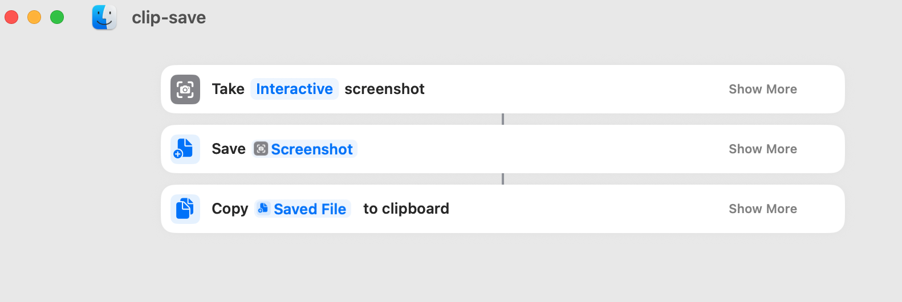

# 便利なGUI操作

## 2026-02-12
- macのデフォルトのスクリーンショットアプリには､画像をファイルとして保存しつつクリップボードにも保存する方法は無さそう｡
    - https://gemini.google.com/share/91718b703b79
    - 範囲選択のスクリーンショットを行い､ファイル保存とクリップボードへのコピーを行う[ショートカット](https://www.icloud.com/shortcuts/433a655ca1f247f48ebc3b3e5d3bde71)を作った｡ 
        - Dock においてつかうとワンクリックで呼び出せて便利
        - 中身
    - ファイルの保存場所と､ファイル名は検討の余地あり｡これまでキャプチャの日付を意識したことがないので､気にせずでもいいかも｡